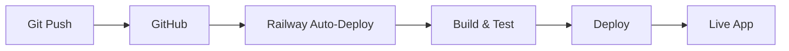

# Railway Deployment Guide - AutoMentor

## 🚀 Automatyczny Deploy z GitHub ($5/miesiąc)

Railway oferuje **najłatwiejszy sposób** na deployment z automatyczną bazą danych PostgreSQL.

## 📋 Kroki Deployment

### 1. Przygotowanie (jednorazowe)

```bash
# Zainstaluj Railway CLI
npm install -g @railway/cli

# Zaloguj się do Railway
railway login
```

### 2. Deploy z GitHub (automatyczny)

**Opcja A: Przez Dashboard (ŁATWIEJSZE)**
1. Idź na https://railway.app/dashboard
2. Kliknij "New Project"
3. Wybierz "Deploy from GitHub repo"
4. Wybierz repo: `breadzskatez/Sebek`
5. Railway automatycznie:
   - Wykryje Node.js projekt
   - Zainstaluje zależności
   - Zbuduje aplikację
   - Stworzy PostgreSQL bazę danych
   - Uruchomi aplikację

**Opcja B: Przez CLI**
```bash
# W folderze projektu
railway init
railway up
```

### 3. Konfiguracja Environment Variables

W Railway Dashboard → Variables, dodaj:

```env
# Wymagane
NODE_ENV=production
SESSION_SECRET=your-super-secret-key-here

# Opcjonalne (dla pełnej funkcjonalności)
STRIPE_SECRET_KEY=sk_live_...
STRIPE_PUBLISHABLE_KEY=pk_live_...
EMAIL_USER=your-email@gmail.com
EMAIL_PASS=your-app-password
OPENAI_API_KEY=sk-...

# Automatycznie ustawione przez Railway
DATABASE_URL=postgresql://...  # Railway ustawi automatycznie
```

### 4. GitHub Auto-Deploy Setup

Railway automatycznie:
- ✅ Monitoruje zmiany na GitHub
- ✅ Auto-deploy przy każdym `git push`
- ✅ Zero downtime deployments
- ✅ Rollback w 1 klik

## 🗄️ Baza Danych

### PostgreSQL (automatyczna)
- Railway automatycznie tworzy PostgreSQL
- Zmienne środowiskowe ustawiane automatycznie
- Backup i monitoring included

### Migracja z SQLite
```bash
# Lokalne środowisko - SQLite
npm run dev

# Produkcja - PostgreSQL (automatycznie)
git push origin master
```

## 💰 Koszt

- **$5/miesiąc** za:
  - Unlimited deploys
  - PostgreSQL database
  - 500GB bandwidth
  - Custom domain
  - SSL certificate
  - Monitoring & logs

## 🔧 Przydatne Komendy

```bash
# Status deploymentu
railway status

# Logi aplikacji
railway logs

# Otwórz aplikację
railway open

# Connect do bazy danych
railway connect

# Lokalne zmienne środowiskowe
railway run npm run dev
```

## 📊 Monitoring

Railway Dashboard zawiera:
- 📈 Real-time metrics
- 🔍 Application logs
- 📊 Database metrics
- ⚡ Performance monitoring
- 🚨 Alerting

## 🔄 Workflow



## 🆘 Troubleshooting

### Build Failed
```bash
# Check logs
railway logs --deployment

# Rebuild
railway up --detach
```

### Database Issues
```bash
# Check database connection
railway connect postgres
```

### Environment Variables
```bash
# List all variables
railway variables

# Set variable
railway variables set KEY=value
```

## 🌐 Custom Domain

1. Railway Dashboard → Settings → Domains
2. Add your domain: `automentor.com`
3. Update DNS CNAME: `railway.app`
4. SSL automatycznie aktywny

## 🎯 Final Result

Po deployment masz:
- ✅ Live app na: `https://your-app.railway.app`
- ✅ Auto-deploy z GitHub
- ✅ PostgreSQL database
- ✅ SSL & CDN
- ✅ Monitoring & logs
- ✅ $5/miesiąc total cost

## 🚀 Quick Start

```bash
# 1. Zainstaluj CLI
npm i -g @railway/cli

# 2. Deploy
railway login
railway init
railway up

# 3. Gotowe! 🎉
```

**Twoja aplikacja będzie live w ~5 minut!** 🚀